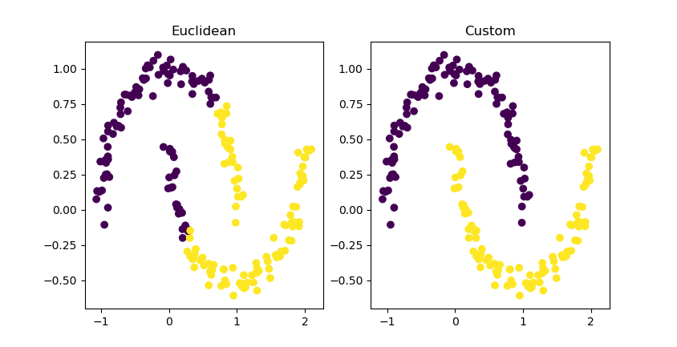

# custom_kmeans
Implementation of the k-means algorithm with customizable distance, and averaging function

## Motivation
The k-means algorithm is a well-known unsupervised learning method that can identify clusters in data. The original version of the k-means algorithm uses Euclidean distance between points as a measure of similarity/difference. However due to [*the curse of dimensionality*](https://en.wikipedia.org/wiki/Curse_of_dimensionality#Distance_functions), Euclidean distance may not be the best option. Therefore, we may want to try different distance functions. A commonly proposed solution is to use cosine distance. As of July 2018, the sklearn implementation of KMeans does not support changing distance metrics and averaging functions, so I've implemented a version here that supports this.

Aside from dimensionality, another problem that is tackled by customizable distance and averaging functions is 'weirdly' shaped clusters (see the example below!)

## Usage
Requires numpy and scipy.

This implementation is modelled after [scikit learn's implementation](http://scikit-learn.org/stable/modules/generated/sklearn.cluster.KMeans.html#sklearn.cluster.KMeans.transform), meaning that it has many of the same function/variable names.

To use, import like this: `from custom_kmeans import KMeans`.

[scipy.spatial.distance](https://docs.scipy.org/doc/scipy/reference/spatial.distance.html) has some distance functions that work out of the box. Or you can write your own distance function. The only requirement is that the function must take in two vectors and return a number.

The averaging function can also be customized. The averaging function should take in a list of points and return another point with the same number of dimension representing the 'average' of those points.

See the Examples section below for an example on using custom distances and averaging functions for the 2-dimensional 'moons' dataset.

## Docs
class KMeans(k, n_init=10, metric=distance.euclidean, 
        average_fn=lambda x: np.mean(x, axis=0), max_iter=100)

The default parameters give the usual KMeans algorithm with Euclidean metric and using the mean to compute cluster centroids.
### Parameters
k <int>: Number of clusters

n_init <int>: Number of initializations to try

metric <fn>: Function that takes in two arrays and returns a number
                (used as the distance metric)

average_fn <fn>: Function that takes in a matrix X
                    and returns the center of the points.

max_iter <int>: Maximum number of iterations to run before the 
                    algorithm terminates

### Attributes
inertia_ <float>: Sum of distances for each point to its centroid
                    Where distance is taken as the metric argument.

cluster_centers_ <2d array>: Each row represents the coordinates of one centroid

labels_ <array>: A list of assignments.

### Functions
fit, fit_predict, predict

These behave as in [scikit learn's implementation](http://scikit-learn.org/stable/modules/generated/sklearn.cluster.KMeans.html#sklearn.cluster.KMeans.transform)

## Example

In this example, we want to put each moon in it's own cluster. We see that using Euclidean distance doesn't get us what we want as the left side of the U-shaped moon is close (in terms of Euclidean distance) to points on the other moon. To solve this I've implemented a custom distance function that assumes one point is the critical point of a parabola defined by y = ax^2 +bx+c, where a is either -1 or +1. It then calculates the distance as the difference in the actual y coordinate of the point and the predicted y coordinate by the parabola. 

TODO prove that this is/is not a valid metric.

The averaging function also needed to be changed, as we want our centroids to be the min/max of the two moons, and if we were just using the mean, the y-coordinate would be pulled towards the center. Therefore the averaging function that I used was to find the median x coordinate and just take that point as the 'average point'.

See examples.py for more details on this example

